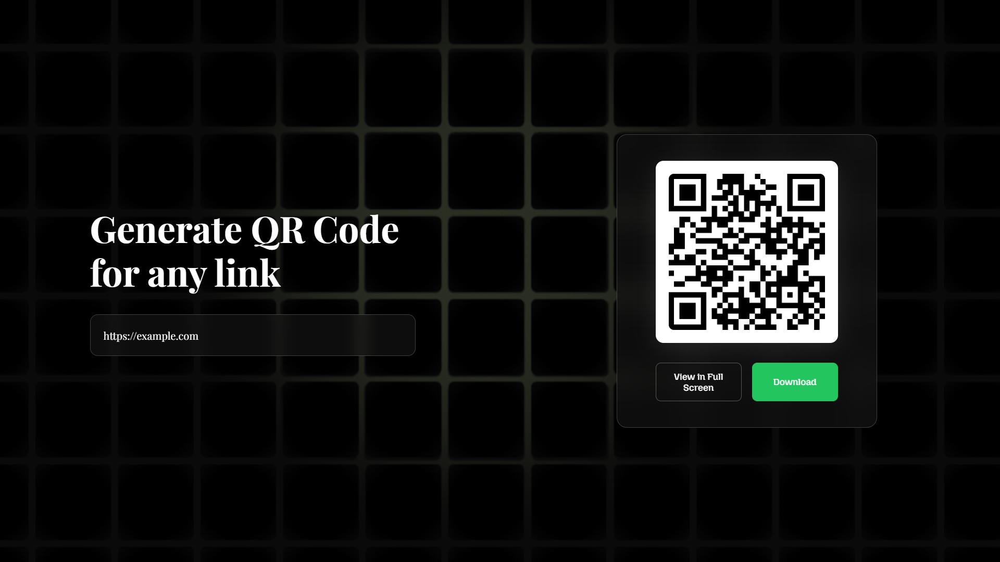

# 🎯 QR Code Generator

A modern, elegant QR code generator built with vanilla JavaScript that creates high-quality QR codes for any URL or text input. Features a beautiful glassmorphism UI design with custom typography and seamless user experience.

## 🌟 Link for the website

🔗 **[Try it live here](https://0xujwal.github.io/QR-Code-generator/)** 

## ✨ Features

- **🚀 Instant QR Generation** - Real-time QR code creation as you type
- **📱 High Resolution** - 720x720px QR codes for crystal clear scanning
- **💾 Download Functionality** - Save QR codes as PNG files with timestamp
- **🖥️ Full Screen View** - View QR codes in a dedicated full-screen window
- **📱 Responsive Design** - Works perfectly on desktop, tablet, and mobile
- **🎨 Modern UI** - Beautiful glassmorphism design with custom fonts
- **⚡ Lightweight** - Pure vanilla JavaScript, no frameworks required
- **🔒 Privacy Focused** - All processing happens client-side

## 🛠️ Technology Stack

- **Frontend**: HTML5, CSS3, Vanilla JavaScript
- **QR Generation**: QRCode.js library
- **Styling**: Custom CSS with Glassmorphism effects
- **Typography**: 
  - Playfair Display (Main headings)
  - Mozilla Headline (Buttons)
  - Poppins (Placeholder text)
- **Dependencies**: jQuery 2.1.3

## 💡 How to Use

1. **Enter your link or text** in the input field
2. **Watch the QR code generate** automatically as you type
3. **Download** the QR code by clicking the "Download" button
4. **View full screen** by clicking "View in Full Screen" for better visibility

## 🔒 Privacy & Security

- **No Data Collection** - All processing happens locally in your browser
- **No Server Communication** - QR codes are generated client-side
- **No Analytics** - Your privacy is completely protected

⭐ **Star this repository if you found it helpful!**

Made with ❤️ by Ujwal
